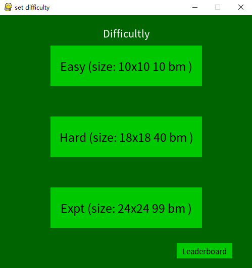
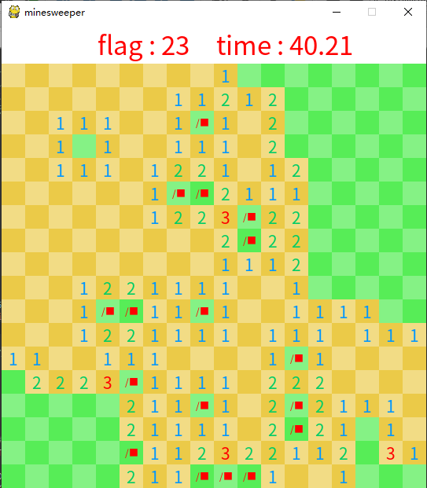
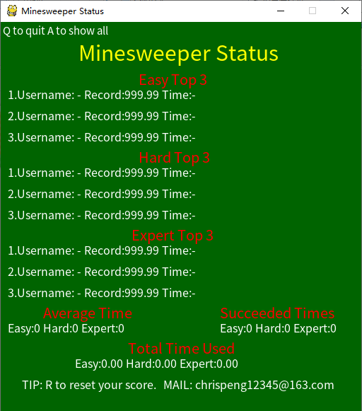

## Minescreeper-扫雷by chrispeng

>_2021/2/1 19:44_   更新内容      
版本1.0-游戏界面完成   
版本1.1-增加了游戏记录页面

- 资料夹内容  
__pycache__ python解析文件  
game.ttf 游戏字体  
inputbox.py 输入框  
mine.py 主体  
README.md 本文件  
status.csv 记录用  
status.py 记录展示页面

- 游玩说明  
普通的扫雷。萌新练习python用。

- 初始页面  
有三个难度以及数据页选项，q退出，a打开数据页面

  
- 游戏内  
点击任意位置开启，把所有安全的格子挖开就获胜。若是挖开任意
雷格即失败，按下q退出。  
局内，左键挖开格子，右键标雷( 旗子： /■ )   
上方有剩余雷数（根据玩家标雷数量减少，不代表实际剩余）  
以及所用时间，获胜后会停止计时。会提示按q退出游戏。  
若是获胜，将会自动记录游戏难度、用时、日期时间。  
注意：按下a将打开所有格子，测试功能，不会导致胜利，也不会写入游戏记录，建议没事不要使用  

- 数据页面  
打开后会有数据显示，从上到下，左到右分别为：  
三个难度的前三数据、三个难度的平均用时（仅记录胜利场次）、  
三个难度的胜利场次、三个难度总用时（仅记录胜利场次）  
上方提示q退出、a展开所有，下方提示r清除记录、以及我的邮箱。
  

- 数据页面（全）  
数据页面按a进入，会展开所有胜利场次信息。按方向键左右翻页。
q退出。  
难度对应：1-easy 2-hard 3-expert

- 难度信息  
Easy-简单模式，大小：10x10格，藏雷数量：10个  
Hard-困难模式，大小：18x18格，藏雷数量：40个  
Expt（Expert）-专家模式，大小：24x24格，藏雷数量：99个

- 游戏玩法  
数字代表周围≤8格的雷数，若无数字则表示周围都是安全的，系统
会自动打开周边的格子。  
一些简单的游玩技巧：反正不是运气游戏，自行百度（？

_作者信息_  
_邮箱：chrispeng12345@163.com_  
_手机号：不告诉你（那你写个毛_